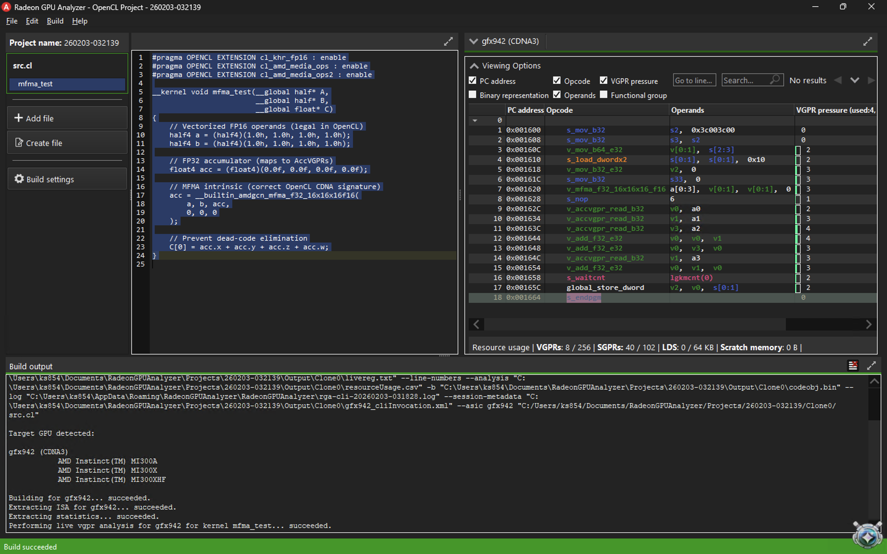

# RGA Resource Analysis: Minimal MFMA Kernel (gfx942)

## Environment
- Tool: Radeon GPU Analyzer
- Target: gfx942 (CDNA3, MI300X)
- API: OpenCL

## Kernel Description
Single MFMA instruction followed by AccVGPR → ArchVGPR reduction.

## Resource Summary
(See resourceUsage.csv)

- VGPRs: <value>
- SGPRs: <value>
- LDS: 0
- Scratch: 0

## Observations
- MFMA accumulator occupies AccVGPRs
- Accumulator values require explicit v_accvgpr_read
- Even minimal MFMA requires domain crossing for ALU work

## Relevance
This confirms that accumulator residency and domain crossing are architectural constraints, not compiler artifacts.

> Note: The following screenshot shows the RGA ISA view and resource usage
> for the minimal MFMA kernel analyzed in this document.

